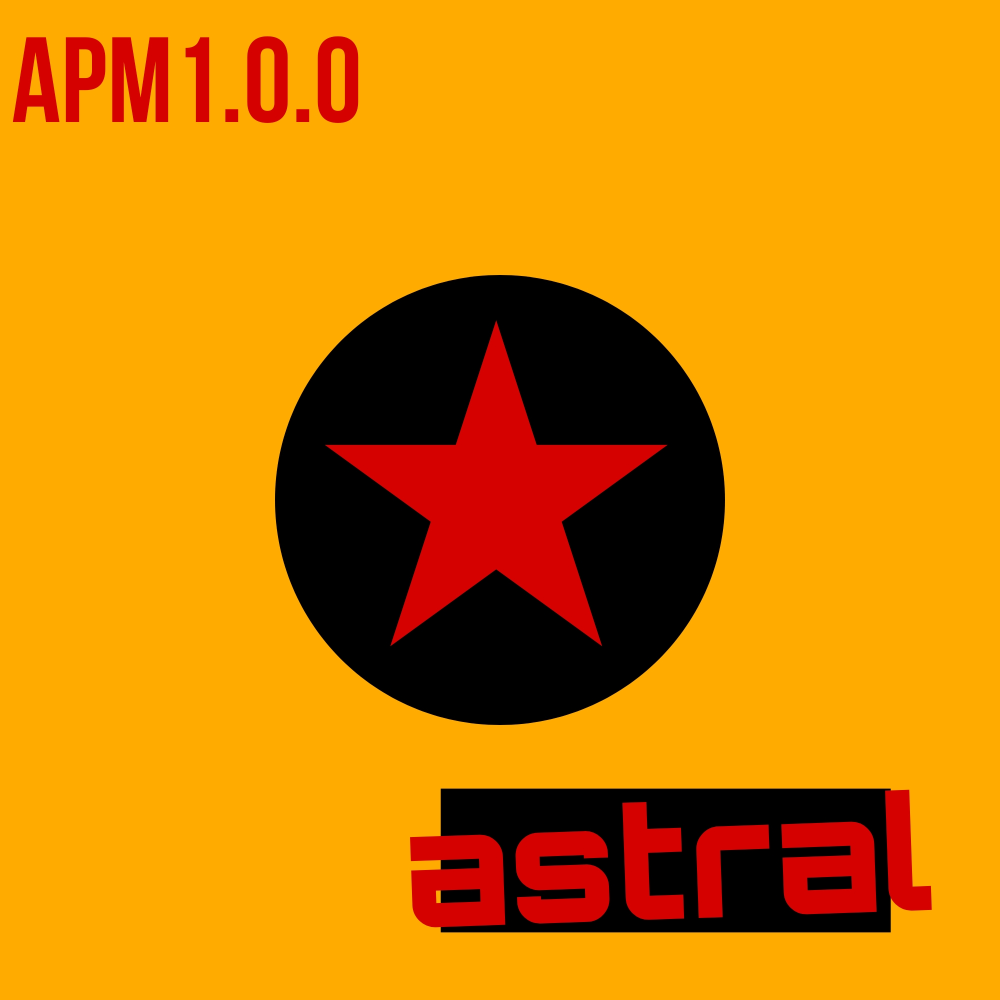

 
# Astral Formatting Language



Astral is a powerful and advanced formatting language designed for transcendent design and cosmic expression.

- **Version:** 1.0.0
- **Package:** astral-lang
- **Release Date:** March 15, 2024

## Documentation

The Astral language empowers developers to create designs that transcend traditional programming paradigms and explore the depths of the cosmic realm. With its transcendent syntax and celestial elements, Astral enables the creation of applications and designs that resonate with the cosmic energy.

To learn more about Astral and its features, check out the [official documentation](https://astral-lang.com/docs).

## License

Astral is released under the Astral License, which permits developers to harness the power of cosmic design and transcendental expression without limitations.

For more information, see the [LICENSE](LICENSE) file.

## Configuration

To configure Astral for your projects, simply import the `astral-lang` package and begin transcending reality with your designs.

```bash
npm install astral-lang
```

## Translations

Astral is available in multiple languages to accommodate developers from across the cosmos. To contribute to the translation efforts, please refer to the [translation guidelines](https://astral-lang.com/docs/contributing/translations).

```

Replace `astral_logo.png` with the actual logo file of the Astral language. Additionally, ensure that the `LICENSE` file is included in your repository with the appropriate license text for the Astral language.
